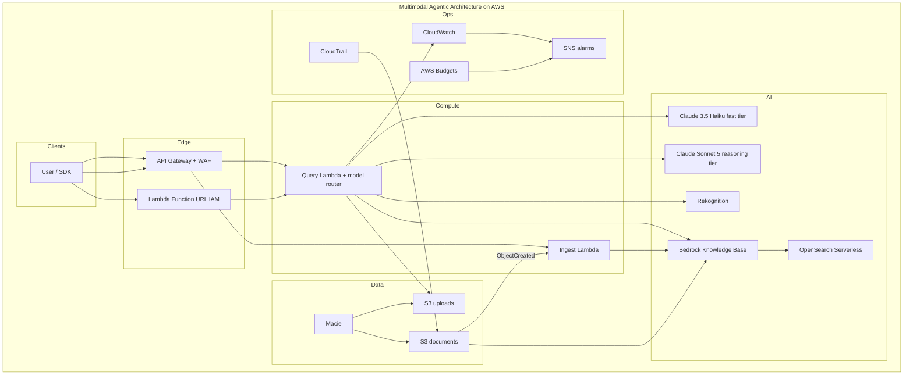

# Multimodal Agentic Architecture on AWS

Production-oriented **serverless** architecture that answers **text + image** questions, grounded in your documents.

The control plane is **Amazon API Gateway → AWS Lambda**. Incoming queries are **cascaded** between **Claude 3.5 Haiku** (fast tier) and **Claude Sonnet 5** (reasoning tier) on the **Amazon Bedrock Converse API**, wrapped with **Bedrock Guardrails**. The agent calls **Amazon Rekognition** (vision) and **Amazon Bedrock Knowledge Bases** (RAG over **OpenSearch Serverless** + **S3**). **Amazon Macie**, **CloudWatch + SNS**, **IAM**, **CloudTrail**, and **AWS Budgets** cover privacy, observability, and cost.

---

## Architecture

```text
          Multimodal Agentic Architecture on AWS
                    ┌─────────────────────────────────────────────────────────┐
  User (text+image) │  Amazon API Gateway (REST, API key, WAF)                │
                    │       POST /v1/query   POST /v1/uploads/presign         │
                    │       POST /v1/documents/presign   POST /v1/ingest      │
                    └───────────────┬───────────────────────────┬─────────────┘
                                    │                           │
                          Query Lambda (2 min)          Ingest Lambda
                          Dual-tier router + agent      S3 event + StartIngestionJob
                                    │
                    ┌───────────────┴───────────────┐
                    ▼                               ▼
           Claude 3.5 Haiku                  Claude Sonnet 5
           (fast: chat / FAQ)                (reasoning / multimodal)
                    └───────────────┬───────────────┘
                                    │
              ┌─────────────────────┼─────────────────────┐
              │                     │                     │
              ▼                     ▼                     ▼
     Amazon Bedrock          Amazon Rekognition    Bedrock Knowledge Base
     Converse + Guardrails   labels/OCR/faces      Retrieve (vector search)
              │                                          │
              │                                          ▼
              │                                 OpenSearch Serverless
              │                                 (k-NN collection)
              │                                          ▲
              │                                          │ ingest
              │                                 S3 documents bucket
              │                                 (Macie PII scan)
              ▼
     CloudWatch Logs/Metrics ── alarms ──► SNS ──► email
     CloudTrail + AWS Budgets + Cost Explorer tags
```



**Happy path**

1. Upload enterprise docs to S3 (`knowledge/…`) → ingest Lambda starts a Knowledge Base sync into OpenSearch Serverless.
2. Optionally upload an image via presigned PUT (preferred over base64).
3. `POST /v1/query` with `{ "query": "...", "image": { "bucket", "key" } }`.
4. The router classifies complexity (heuristics, optional Haiku), then Converse runs on **Haiku** or **Sonnet 5** with the same Guardrails and tools.
5. The selected model may call `analyze_image` and/or `retrieve_knowledge`. Fast-tier turns escalate to Sonnet if vision tools, multi-step tools, or low-confidence answers appear.

API Gateway REST integrations time out at **29 seconds**. The stack also emits **QueryFunctionUrl** (IAM-auth, 2-minute Lambda timeout) for longer multimodal turns. See [docs/architecture.md](docs/architecture.md).

---

## Dual-tier model cascading

High-traffic agents should not spend Sonnet 5 tokens on “hello” or a one-line FAQ. The orchestrator routes every request **before** the tool loop:

| Tier | Default Bedrock id | Used for |
| --- | --- | --- |
| **Fast** | `FAST_TIER_MODEL_ID` = `anthropic.claude-3-5-haiku-20241022-v1:0` | Greetings, chit-chat, simple FAQ, one-shot lookup, tiny summaries |
| **Reasoning** | `REASONING_TIER_MODEL_ID` = `anthropic.claude-sonnet-5` | Images, code, multi-hop RAG, planning, deep comparison. `BEDROCK_MODEL_ID` still overrides this if set |

**Decision path (`src/agent/router.py`)**

1. Client override: `metadata.model_tier` = `fast` \| `reasoning`
2. `ROUTER_MODE`: `heuristic` (no extra Bedrock call), `hybrid` (default — Haiku classifier only when heuristic confidence is low), `reasoning_only`, `fast_only`
3. Heuristics: images, code fences, analysis language → Sonnet; short greetings / `what is` lookups → Haiku
4. **Escalation:** if Haiku starts `analyze_image`, a second tool turn, or answers with low-confidence language, the loop continues on Sonnet 5 (same Guardrails and messages)

**Cost impact:** Haiku is typically an order of magnitude cheaper per token than Sonnet. In mixed production traffic (chat + a smaller share of multimodal/analysis), most invocations stay on the fast tier. Watch CloudWatch metrics `ModelTierFast`, `ModelTierReasoning`, `RouterEscalations`, `AgentLatencyMs`, `InputTokens`, and `OutputTokens`. Structured logs include `model_tier`, `model_id`, `router_reason`, `router_source`, `latency_ms`, and `usage`.

Force a tier per request:

```json
{ "query": "hello", "metadata": { "model_tier": "reasoning" } }
```

---

## Repository layout

```text
.
├── app.py                          # CDK app
├── cdk.json                        # context flags (Macie, Budgets, models)
├── config/                         # local settings wrapper + guardrail spec
├── infra/
│   ├── stacks/multimodal_agentic_architecture_stack.py
│   ├── constructs/                 # storage, AOSS, KB, compute, API, Macie, …
│   └── custom_resources/aoss_index.py
├── src/
│   ├── handlers/                   # query_handler.py, ingest_handler.py
│   ├── agent/                      # orchestrator, router, Converse client, routing
│   ├── tools/                      # Rekognition + Knowledge Base tools
│   ├── observability/              # Lambda Powertools
│   └── utils/                      # S3, images, HTTP
├── tests/unit|integration|e2e
├── scripts/                        # query, ingest, export stack outputs
├── samples/documents|requests
└── docs/                           # architecture, security, operations
```

---

## Prerequisites

| Tool | Notes |
| --- | --- |
| Python 3.12+ | Lambda and CDK runtime |
| Node.js 18+ and AWS CDK CLI | `npm install -g aws-cdk` |
| Docker | Required to bundle Lambda (`PythonFunction`) |
| AWS CLI v2 | Named profile with permissions to deploy the stack |
| Model access | Bedrock console → enable **Claude Sonnet 5** and **Claude 3.5 Haiku** plus Titan Text Embeddings V2 |

Suggested IAM for the deployer (not the runtime roles): CloudFormation, IAM, Lambda, API Gateway, S3, KMS, Bedrock, AOSS, Rekognition (none at deploy), Macie, CloudTrail, Budgets, CloudWatch, SNS, WAFv2.

Region default is `us-east-1`. Override with `cdk deploy --region …` and matching model IDs.

---

## Local setup

```bash
git clone https://github.com/<your-username>/multimodal-agentic-architecture-aws.git
cd multimodal-agentic-architecture-aws
python3 -m venv .venv
source .venv/bin/activate          # Windows: .venv\Scripts\activate
pip install -r requirements-dev.txt
cp .env.example .env
pytest tests -q -m "not integration and not e2e"
```

---

## Deploy

```bash
export AWS_PROFILE=your-profile
export AWS_REGION=us-east-1
cdk bootstrap
cdk synth
cdk deploy --context alarmEmail=you@example.com --context monthlyBudgetUsd=150
```

Useful context keys (also in `cdk.json`):

| Key | Default | Purpose |
| --- | --- | --- |
| `stackName` | `MultimodalAgenticArchitectureStack` | CloudFormation / CDK stack id |
| `projectName` | `multimodal-agentic-architecture-aws` | `Project` tag, KMS alias, Cost Explorer filter |
| `bedrockModelId` | `anthropic.claude-sonnet-5` | Reasoning-tier Converse id (also `REASONING_TIER_MODEL_ID`)
| `fastTierModelId` | `anthropic.claude-3-5-haiku-20241022-v1:0` | Fast-tier Haiku id |
| `routerMode` | `hybrid` | `heuristic` / `hybrid` / `reasoning_only` / `fast_only` |
| `embeddingModelId` | `amazon.titan-embed-text-v2:0` | Knowledge Base embeddings (1024-d) |
| `enableMacie` | `true` | Daily PII classification on S3 |
| `enableCloudTrail` | `true` | Trail + S3 data events |
| `enableBudgets` | `true` | Monthly cost budget + SNS |
| `alarmEmail` | `""` | SNS email for alarms and budget |

After deploy:

```bash
eval "$(python scripts/export_outputs.py --stack MultimodalAgenticArchitectureStack --region us-east-1)"
# writes API_BASE_URL, API_KEY, KNOWLEDGE_BASE_ID, buckets, guardrail ids
printf '\nAPI_BASE_URL=%s\nAPI_KEY=%s\n' "$API_BASE_URL" "$API_KEY" >> .env
```

Confirm the **SNS email subscription** in your inbox or alarms will not notify.

First-time Macie enablement is **account-level**. If Macie is already on, deploy with `--context enableMacie=false`.

---

## Ingest knowledge

```bash
python scripts/ingest_document.py samples/documents/ppe_policy.md
```

Or with cURL:

```bash
# 1) Presign
curl -s -X POST "$API_BASE_URL/v1/documents/presign" \
  -H "x-api-key: $API_KEY" -H "content-type: application/json" \
  -d '{"filename":"ppe_policy.md","content_type":"text/markdown"}' | tee /tmp/presign.json

# 2) PUT the file (headers come from the presign response)
python - <<'PY'
import json, pathlib, urllib.request
p=json.load(open("/tmp/presign.json"))
req=urllib.request.Request(p["url"], data=pathlib.Path("samples/documents/ppe_policy.md").read_bytes(),
                           headers=p["headers"], method="PUT")
print(urllib.request.urlopen(req).status)
PY
```

Wait until the Knowledge Base ingestion job is `COMPLETE` (CloudWatch logs on the ingest function, or Bedrock console).

---

## Query examples

### Text-only RAG (cURL)

```bash
curl -s -X POST "$API_BASE_URL/v1/query" \
  -H "x-api-key: $API_KEY" -H "content-type: application/json" \
  -d '{"query":"According to our PPE policy, what must be worn in Zone A?"}'
```

### Multimodal (Python helper)

```bash
python scripts/test_query.py \
  --query "Is the PPE in this photo compliant with Zone A? Cite the handbook." \
  --image /path/to/helmet.jpg
```

Prefer S3 references for production payloads (API Gateway limit 10 MB; WAF/body size):

```bash
# Presign an image, PUT it, then query by bucket/key
curl -s -X POST "$API_BASE_URL/v1/uploads/presign" \
  -H "x-api-key: $API_KEY" -H "content-type: application/json" \
  -d '{"filename":"helmet.jpg","content_type":"image/jpeg"}'
```

```json
{
  "query": "Is this helmet compliant with Zone A policy?",
  "image": { "bucket": "UPLOADS_BUCKET", "key": "uploads/2026/08/20/abc.jpg" }
}
```

### Health

```bash
curl -s "$API_BASE_URL/v1/health"
```

---

## Agent tools

The selected **tier** runs Converse. Sonnet 5 keeps adaptive thinking (`THINKING_TYPE=adaptive`); Haiku uses a low temperature and a smaller `FAST_TIER_MAX_TOKENS`. Images are sent as Converse `image` blocks (pixels first) and always route to the reasoning tier.

| Tool | AWS API | When it runs |
| --- | --- | --- |
| `analyze_image` | Rekognition DetectLabels, DetectText, DetectFaces, DetectModerationLabels | Image attached or model requests structured vision |
| `retrieve_knowledge` | `bedrock-agent-runtime.retrieve` | Policy / document / “according to us” questions |

Guardrails are applied on **every** `converse` call via `guardrailIdentifier` + `guardrailVersion`.

---

## Security and Responsible AI

- Least-privilege IAM roles split query vs ingest vs Knowledge Base.
- S3: public access blocked, TLS only, KMS CMK, versioning, access logs.
- Bedrock Guardrails: HIGH content filters, PII anonymization, denied topics (weapons, cyber attacks).
- Macie daily jobs on document and upload buckets.
- CloudTrail management + S3 data events; CloudWatch alarms to SNS.
- Rekognition is used for labels/OCR/moderation — **not** for identifying private individuals. The system prompt forbids naming people from faces.

Details: [docs/security.md](docs/security.md).

---

## Observability and cost

- Dashboard **MultimodalAgenticArchitectureAws** (errors, duration, 5XX, throttles).
- Custom metrics: `ModelTierFast`, `ModelTierReasoning`, `RouterEscalations`, `AgentLatencyMs`, token counts.
- Alarms: Lambda errors, API 5XX, p99 duration, budget 80% / 100% forecast.
- Tag `Project=multimodal-agentic-architecture-aws` for Cost Explorer.
- CloudWatch log groups: `/aws/lambda/multimodal-agentic-query-handler`, `/aws/lambda/multimodal-agentic-ingest-handler`, `/aws/apigateway/multimodal-agentic-architecture-aws`.
- OpenSearch Serverless bills **minimum OCUs while the collection exists**. Destroy non-prod stacks.

```bash
cdk destroy
```

---

## Testing

```bash
make test          # unit tests, no AWS
pytest tests/e2e -m e2e   # live health check when API_BASE_URL is set
```

---

## Responsible use

This is a scaffold for a production *shape*, not a compliance certification. Before handling regulated data: add Cognito or IAM authz, consider VPC endpoints, review Bedrock data-logging settings, and run a threat model. Do not send secrets, credentials, or unrestricted PII to the model.

---

## License

MIT. See [LICENSE](LICENSE).
